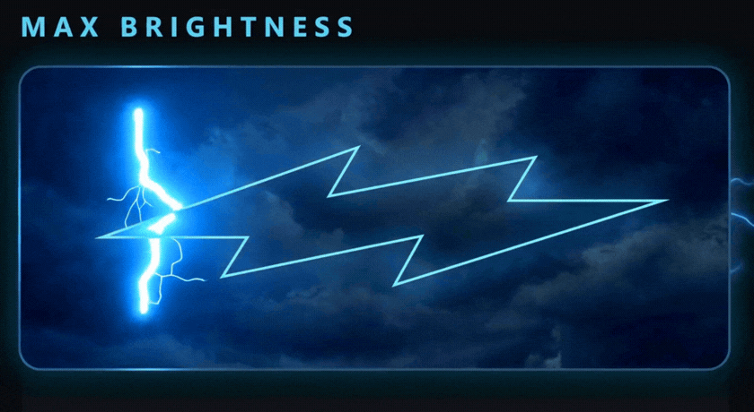
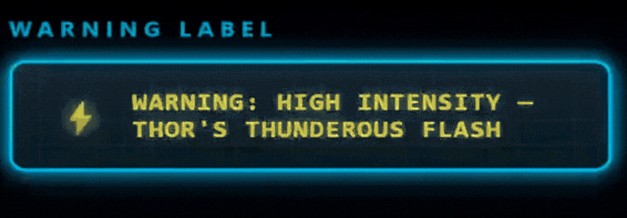

# Thor's Thunderous Flash ⚡







A dead-simple Android **home-screen widget** (and app icon) that turns on your
phone's flashlight at **true maximum brightness** — the same ceiling the
built-in flashlight button hits, not the dim level most widget apps settle for.

## Why this is brighter than your old widget

Most flashlight widgets call `setTorchMode(true)`, which lights the LED at the
system's *default* strength — often well below what the LED can actually do.
This app calls **`turnOnTorchWithStrengthLevel()`** at the phone's reported
**maximum** strength level (Android 13+), so the LED runs as bright as the
hardware physically allows. On a Samsung Galaxy that matches the bright native
flashlight instead of the weak default.

> Note: no app can go *brighter than the hardware maximum* — that's a physical
> limit of the LED. This app's job is to reach that maximum, which your old
> widget wasn't doing.

## What you get

- **A home-screen widget** made from a real **Mjölnir photo** — cut out, stood
  upright, head on top. Tap it → LED on at max, and three lightning bolts blaze
  gold out of the hammer's crown. Tap again → off, and the hammer dims and the
  bolts go dead gray, so you can tell at a glance it's off.
- **An app icon** ("Thor's Thunderous Flash") that does the same thing when tapped.

---

## How to build & install it (on your PC)

You need to turn this source code into an installable `.apk` and put it on your
phone. The easiest way is **Android Studio**.

### Option A — Android Studio (recommended)

1. Install [Android Studio](https://developer.android.com/studio) (free).
2. **File → Open** and select this `flashlight-widget` folder.
3. Let it sync (it downloads the Android SDK the first time — just click
   through the prompts).
4. Plug your phone in over USB, or build an APK:
   - **To install straight to a plugged-in phone:** enable USB debugging on the
     phone (see below), then press the green **Run** ▶ button.
   - **To get an APK file:** menu **Build → Build App Bundle(s) / APK(s) →
     Build APK(s)**. When it finishes, click **locate** to find
     `app/build/outputs/apk/debug/app-debug.apk`. Copy that to your phone and
     tap it to install.

### Option B — Command line

From this folder, with the Android SDK installed and `ANDROID_HOME` set:

```bash
./gradlew assembleDebug
```

The APK lands at `app/build/outputs/apk/debug/app-debug.apk`.

---

## Getting the APK onto your Samsung and enabling install

1. **Allow install from unknown sources:** when you tap the APK, Android will
   ask to allow your file manager / browser to install unknown apps — say yes.
2. (For USB install instead) **Enable Developer Options + USB debugging:**
   - Settings → **About phone** → **Software information** → tap **Build
     number** 7 times.
   - Back in Settings → **Developer options** → turn on **USB debugging**.

## Adding the widget to your home screen

1. **Long-press an empty spot** on your home screen → **Widgets**.
2. Find **Thor's Thunderous Flash** in the list.
3. **Drag the little flashlight** onto your home screen.
4. Tap it — the LED fires at max. Tap again to turn it off.

That's it. One press, brightest your phone can go.

---

## Requirements & notes

- **Android 8.0+** to install; **Android 13+** for the true max-strength boost
  (older phones still get full-on, which is their hardware max anyway).
- Needs a phone with a camera flash LED (every Galaxy has one).
- No internet permission, no ads, no tracking — it only talks to the flashlight.
- If the LED won't turn on, close any open **Camera** app first (the camera and
  the torch can't both own the flash at the same time).
